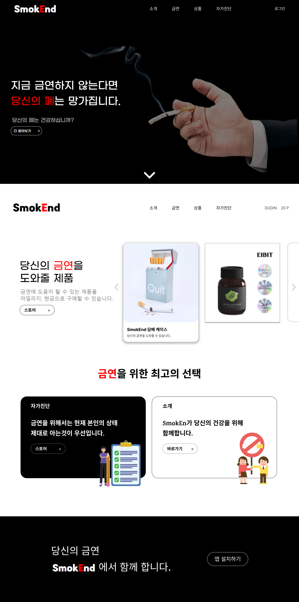
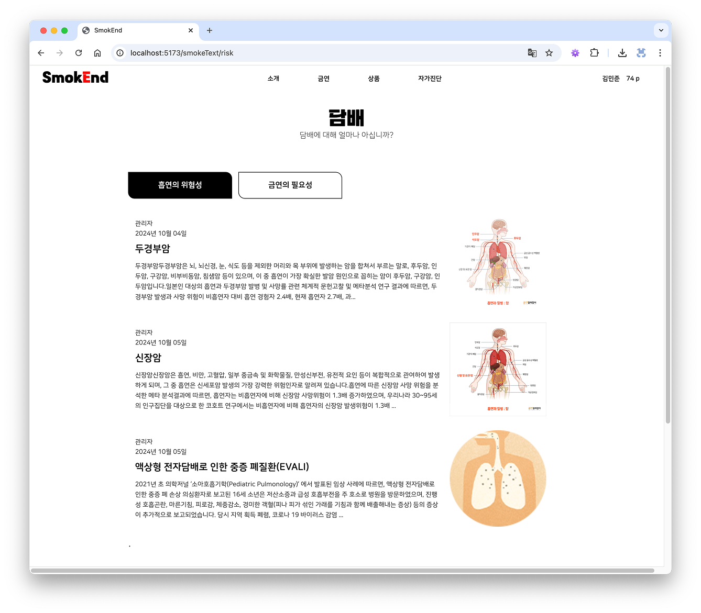
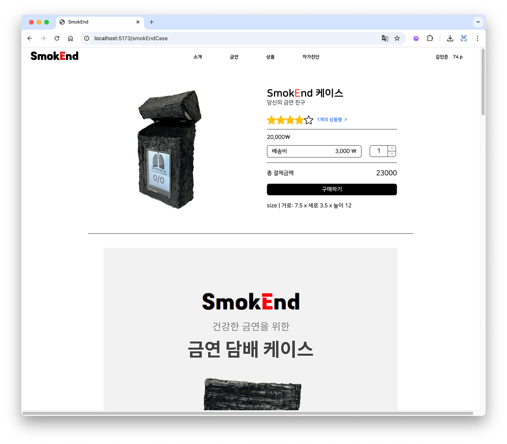
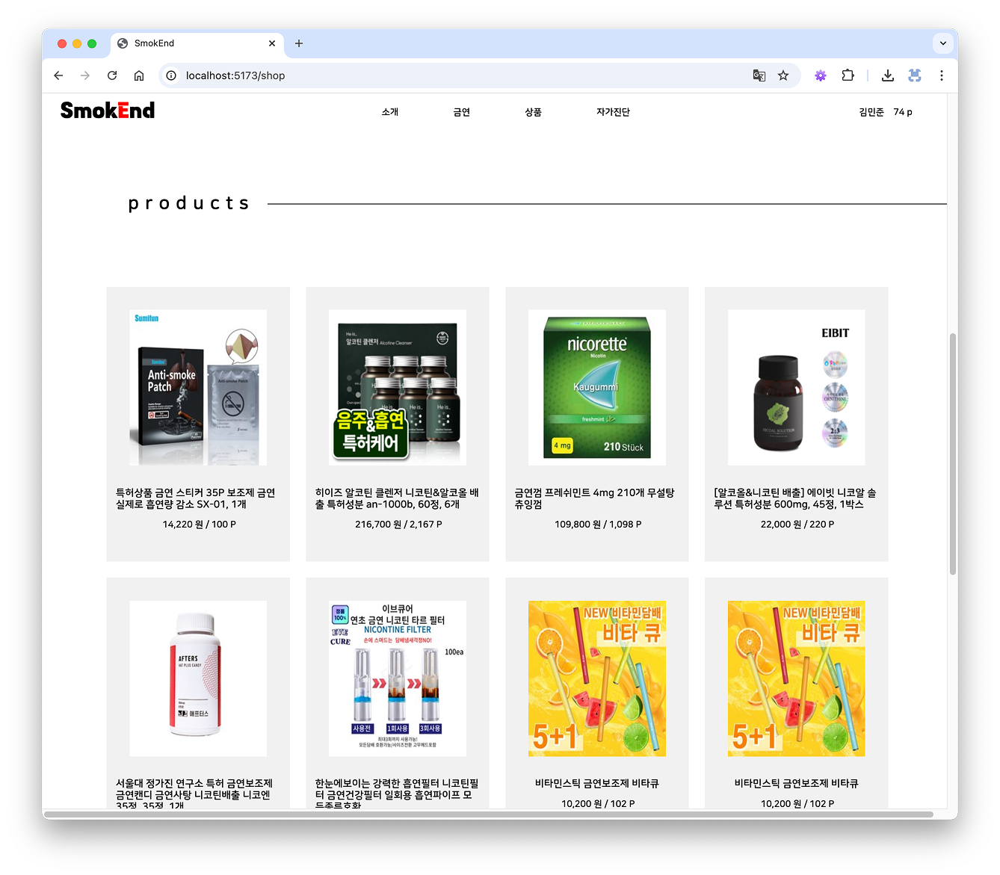
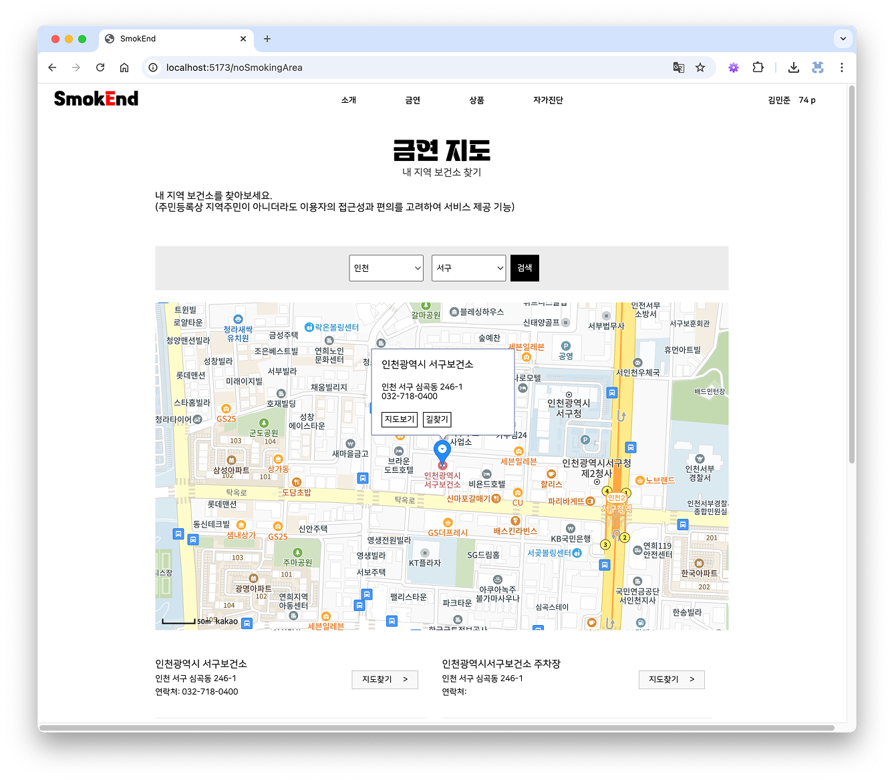
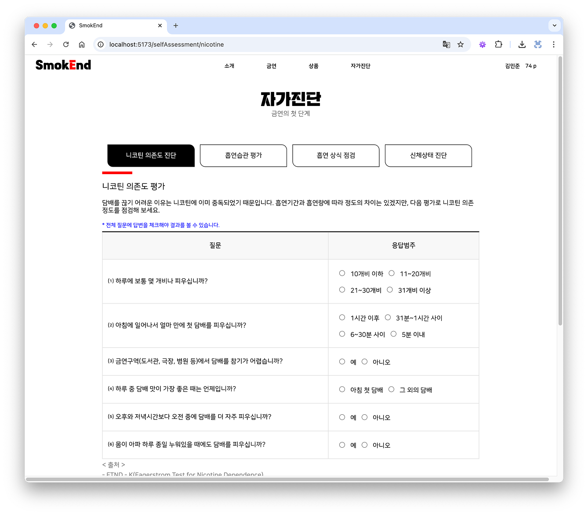
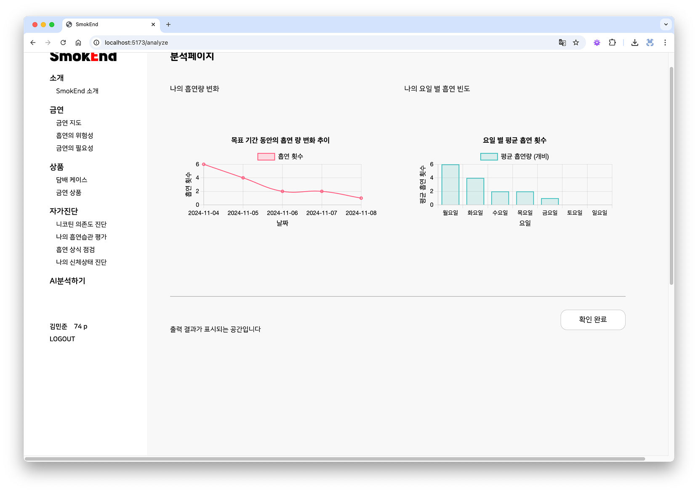

# 금연하조 웹사이트

흡연으로부터 건강한 변화를 시작할 수 있도록  
금연 제품 정보, 자가진단 테스트, 금연 클리닉 위치 안내 등을 제공하는 금연 지원 웹 서비스입니다.

---

## 프로젝트 개요

**금연하조 웹사이트**는 사용자가 금연을 시작하고 유지하는 데 필요한 정보를 통합 제공하는 웹 플랫폼입니다.  
제품 정보, 자가진단 테스트, 위치 기반 금연 지원기관 조회, 마이페이지 기능 등을 통해  
실질적인 금연 실행과 유지를 돕습니다.

---

## 주요 기능

- 금연 보조제 정보 및 구매 안내  
- 금연 정보 페이지  
- 위치 기반 금연 클리닉 찾기  
- 자가진단 테스트 (흡연 습관 분석)  
- 마이페이지 – 금연 현황 대시보드  
- 반응형 디자인

---

## 시연 화면

### 1. 메인 페이지

<div style="display: flex; align-items: flex-start; gap: 20px;"> 
  <p>
    메인 화면에서는 최신 금연 제품과 추천 아이템,  
    금연 독려 슬로건이 배치되어 있습니다.
  </p>
  
</div>

---

### 2. 금연 정보 페이지

<div style="display: flex; align-items: flex-start; gap: 20px;">
  <p>
    흡연이 신체에 미치는 영향, 금연 성공 사례 등을 소개하는 교육용 콘텐츠입니다.
  </p>
  
</div>

---

### 3. 제품 상세 페이지

<div style="display: flex; align-items: flex-start; gap: 20px;">
   <p>
    팀에서 개발한 흡연량 측정 스마트 담배 케이스의<br/>
    제품 이미지, 주요 기능, 사용 방법 등이 담긴 상세 소개 화면입니다.<br/>
    사용자의 흡연 습관을 기록하고 금연을 유도하는 핵심 하드웨어로,<br/>
    앱/웹 플랫폼과 연동되어 금연 현황 시각화 및 데이터 분석에 활용됩니다.<br/>
  </p>
  
</div>

---

### 4. 금연 보조제 리스트

<div style="display: flex; align-items: flex-start; gap: 20px;">
  <p>
    다양한 금연 제품을 한눈에 비교하고 외부 사이트 이동 구메 가능한 페이지입니다.
  </p>
  
</div>

---

### 5. 위치 기반 지도 서비스

<div style="display: flex; align-items: flex-start; gap: 20px;">
  <p>
    사용자 위치 주변의 금연 클리닉, 보건소, 상담 기관을 찾을 수 있는 지도 기반 기능입니다.
  </p>
  
</div>

---

### 6. 자가진단 테스트

<div style="display: flex; align-items: flex-start; gap: 20px;">
  <p>
    사용자의 흡연 습관과 금연 의지를 점검할 수 있는 페이지입니다.  
    선택형 문항과 점수 기반 분석 결과를 제공하며, 유형별 조언도 함께 안내됩니다.
  </p>
  
</div>

---

### 7. 마이페이지 – 금연 대시보드

<div style="display: flex; align-items: flex-start; gap: 20px;">
  <p>
    금연 시작일부터 오늘까지의 진행 상태, 금연 성공률을 시각적으로 보여주는 대시보드입니다.  
  </p>
  
</div>

---

## 👥 팀 소개

| 역할 | 이름 |
|------|------|
| 웹 | 최수진, 김효진 |
| 앱 | 오건근, 이근오 |
| 백엔드 | 김민준 |
| 하드웨어 | 최현진 |

건강 캠페인을 위한 서비스로,  
**실질적인 금연 실천에 도움이 되는 구조**를 목표로 기획·개발하였습니다.

---

## 실행 방법

```bash
cd smokEnd_web

npm install
npm run start


